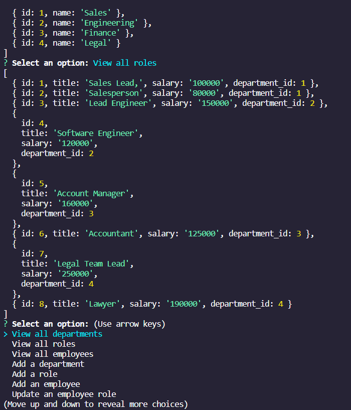

# employee-tracker

 

## Links

GitHub Repository: https://github.com/CatCorbin/employee-tracker 
Demo Video:

## Description

This application keeps track of a company's departments, jobs, employees, employees' salaries, and employees' managers. It makes looking at who does what very simple and can quickly generate a spreadsheet containing all this data.

## Table of Contents

- [Installation](#installation)
- [Usage](#usage)
- [License](#license)
- [Contributions](#contributions)
- [Tests](#tests)
- [Questions](#questions)

## Installation

N/A

## Usage

This project can be used by any company, big or small. It saves time and headache by creating a spreadsheet of all employees including their job title, department, and manager. This spreadsheet can be further used to look at specific departments or specific employees as well as their salaries. When an employee is promoted, that change can be made right through the command line interface to adjust the existing spreadsheet. If new departments or employees are added, it's simple to adjust the spreadsheet to reflect that.

## License

The Unlicense

## Contributions

None

## Tests

Test the application through the command line interface (CLI).

## Questions
<ul>
<li> <a href = "https://github.com/CatCorbin">github profile</a>
</li>
<li> <a href = "mailto:catcorbin0919@gmail.com">email </a> </li>
</li>